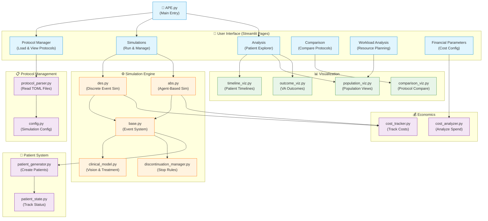

```mermaid
graph TB
      %% Main Entry Point
      APE["🦍 APE.py<br/>(Main Entry)"]

      %% Pages/UI Layer
      subgraph "📱 User Interface (Streamlit Pages)"
          PM["Protocol Manager<br/>(Load & View Protocols)"]
          SIM["Simulations<br/>(Run & Manage)"]
          ANAL["Analysis<br/>(Patient Explorer)"]
          COMP["Comparison<br/>(Compare Protocols)"]
          WL["Workload Analysis<br/>(Resource Planning)"]
          FIN["Financial Parameters<br/>(Cost Config)"]
      end

      %% Core Simulation Engine
      subgraph "⚙️ Simulation Engine"
          BASE["base.py<br/>(Event System)"]
          DES["des.py<br/>(Discrete Event Sim)"]
          ABS["abs.py<br/>(Agent-Based Sim)"]
          CLIN["clinical_model.py<br/>(Vision & Treatment)"]
          DISC["discontinuation_manager.py<br/>(Stop Rules)"]
      end

      %% Protocol System
      subgraph "📋 Protocol Management"
          PROTO["protocol_parser.py<br/>(Read TOML Files)"]
          CONFIG["config.py<br/>(Simulation Config)"]
      end

      %% Patient Generation
      subgraph "👥 Patient System"
          PGEN["patient_generator.py<br/>(Create Patients)"]
          PSTATE["patient_state.py<br/>(Track Status)"]
      end

      %% Economics Module
      subgraph "💰 Economics"
          COST["cost_tracker.py<br/>(Track Costs)"]
          ECON["cost_analyzer.py<br/>(Analyze Spend)"]
      end

      %% Visualization
      subgraph "📊 Visualization"
          TVIZ["timeline_viz.py<br/>(Patient Timelines)"]
          PVIZ["population_viz.py<br/>(Population Views)"]
          OVIZ["outcome_viz.py<br/>(VA Outcomes)"]
          CVIZ["comparison_viz.py<br/>(Protocol Compare)"]
      end

      %% Data Flow
      APE --> PM
      APE --> SIM
      APE --> ANAL

      PM --> PROTO
      PROTO --> CONFIG

      SIM --> DES
      SIM --> ABS
      DES --> BASE
      ABS --> BASE

      BASE --> CLIN
      BASE --> DISC
      BASE --> PGEN
      PGEN --> PSTATE

      DES --> COST
      ABS --> COST

      ANAL --> TVIZ
      ANAL --> PVIZ
      ANAL --> OVIZ

      COMP --> CVIZ
      WL --> PVIZ
      FIN --> ECON

      %% Styling
      classDef ui fill:#e1f5fe,stroke:#0288d1
      classDef engine fill:#fff3e0,stroke:#ff6f00
      classDef data fill:#f3e5f5,stroke:#7b1fa2
      classDef viz fill:#e8f5e9,stroke:#388e3c

      class APE,PM,SIM,ANAL,COMP,WL,FIN ui
      class BASE,DES,ABS,CLIN,DISC engine
      class PROTO,CONFIG,PGEN,PSTATE,COST,ECON data
      class TVIZ,PVIZ,OVIZ,CVIZ viz
```