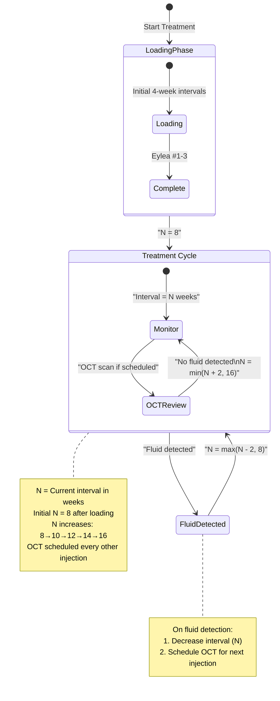

```mermaid
stateDiagram-v2
    [*] --> LoadingPhase: Start Treatment

    state LoadingPhase {
        [*] --> Loading: Initial 4-week intervals
        Loading --> Complete: Eylea #1-3
    }

    state "Treatment Cycle" as TreatmentCycle {
        [*] --> Monitor: "Interval = N weeks"
        Monitor --> OCTReview: "OCT scan if scheduled"
        OCTReview --> Monitor: "No fluid detected\nN = min(N + 2, 16)"
    }

    LoadingPhase --> TreatmentCycle: "N = 8"
    
    TreatmentCycle --> FluidDetected: "Fluid detected"
    FluidDetected --> TreatmentCycle: "N = max(N - 2, 8)"

    note right of TreatmentCycle
        N = Current interval in weeks
        Initial N = 8 after loading
        N increases: 8→10→12→14→16
        OCT scheduled every other injection
    end note

    note right of FluidDetected
        On fluid detection:
        1. Decrease interval (N)
        2. Schedule OCT for next injection
    end note
```
