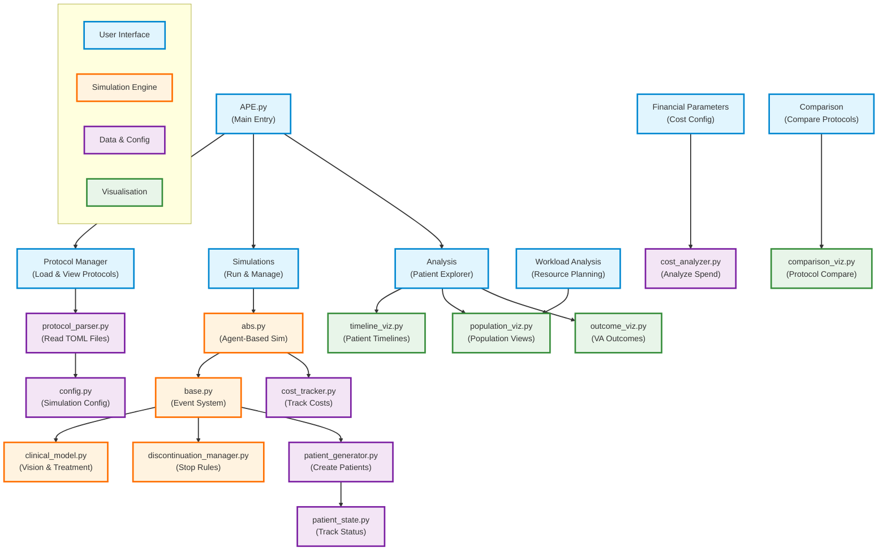

# APE Architecture Diagram

```mermaid
graph TB
    %% Main Entry Point
    APE["APE.py<br/>(Main Entry)"]
    
    %% Pages/UI Layer - User Interface (Streamlit Pages)
    PM["Protocol Manager<br/>(Load & View Protocols)"]
    SIM["Simulations<br/>(Run & Manage)"]
    ANAL["Analysis<br/>(Patient Explorer)"]
    COMP["Comparison<br/>(Compare Protocols)"]
    WL["Workload Analysis<br/>(Resource Planning)"]
    FIN["Financial Parameters<br/>(Cost Config)"]
    
    %% Core Simulation Engine
    BASE["base.py<br/>(Event System)"]
    ABS["abs.py<br/>(Agent-Based Sim)"]
    CLIN["clinical_model.py<br/>(Vision & Treatment)"]
    DISC["discontinuation_manager.py<br/>(Stop Rules)"]
    
    %% Protocol System
    PROTO["protocol_parser.py<br/>(Read TOML Files)"]
    CONFIG["config.py<br/>(Simulation Config)"]
    
    %% Patient Generation
    PGEN["patient_generator.py<br/>(Create Patients)"]
    PSTATE["patient_state.py<br/>(Track Status)"]
    
    %% Economics Module
    COST["cost_tracker.py<br/>(Track Costs)"]
    ECON["cost_analyzer.py<br/>(Analyze Spend)"]
    
    %% Visualisation
    TVIZ["timeline_viz.py<br/>(Patient Timelines)"]
    PVIZ["population_viz.py<br/>(Population Views)"]
    OVIZ["outcome_viz.py<br/>(VA Outcomes)"]
    CVIZ["comparison_viz.py<br/>(Protocol Compare)"]
    
    %% Legend boxes
    subgraph legend[" "]
        L1["User Interface"]:::ui
        L2["Simulation Engine"]:::engine  
        L3["Data & Config"]:::data
        L4["Visualisation"]:::viz
    end
    
    %% Data Flow with thicker lines
    APE ==> PM
    APE ==> SIM
    APE ==> ANAL
    
    PM ==> PROTO
    PROTO ==> CONFIG
    
    SIM ==> ABS
    ABS ==> BASE
    
    BASE ==> CLIN
    BASE ==> DISC
    BASE ==> PGEN
    PGEN ==> PSTATE
    
    ABS ==> COST
    
    ANAL ==> TVIZ
    ANAL ==> PVIZ
    ANAL ==> OVIZ
    
    COMP ==> CVIZ
    WL ==> PVIZ
    FIN ==> ECON
    
    %% Styling with darker strokes
    classDef ui fill:#e1f5fe,stroke:#0288d1,stroke-width:3px
    classDef engine fill:#fff3e0,stroke:#ff6f00,stroke-width:3px
    classDef data fill:#f3e5f5,stroke:#7b1fa2,stroke-width:3px
    classDef viz fill:#e8f5e9,stroke:#388e3c,stroke-width:3px
    
    class APE,PM,SIM,ANAL,COMP,WL,FIN ui
    class BASE,ABS,CLIN,DISC engine
    class PROTO,CONFIG,PGEN,PSTATE,COST,ECON data
    class TVIZ,PVIZ,OVIZ,CVIZ viz
    
    %% Link styling for darker arrows
    linkStyle default stroke:#333,stroke-width:2px
```